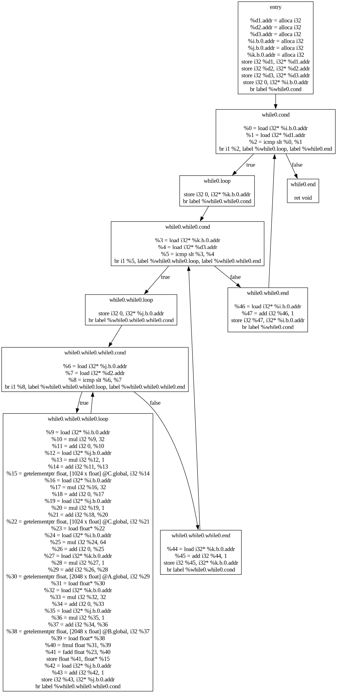
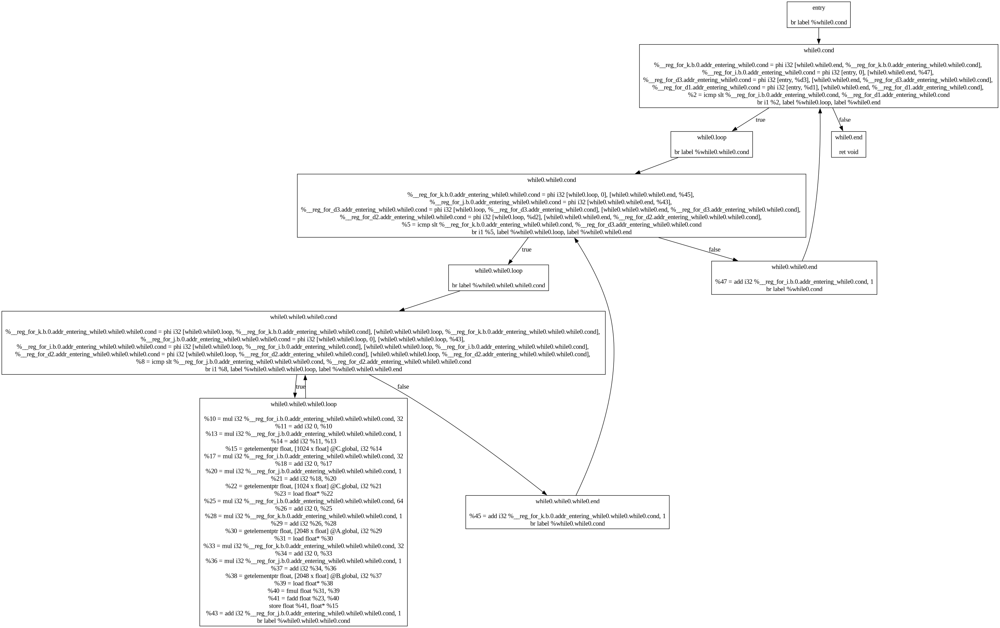
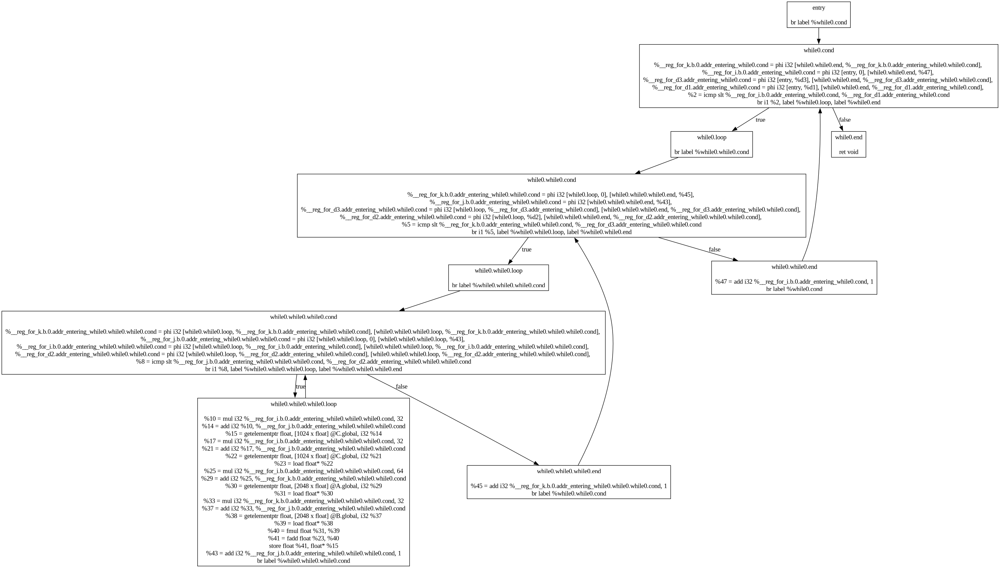

# CACT Lab Project-3 Report:

## 0. How to use

编译构建所有CMake目标，可以在`cact-rie`目录下看到生成的可执行文件`cact-rie`。该可执行文件为CACT语言前端，将CACT代码翻译为LLVM代码。
在chiisai-llvm目录下可以看到可执行文件rv32i，该可执行文件为LLVM IR到RV32的翻译器(PS: 尚未完成)。

除了这些以外，也可以看到一些辅助工具，例如用于观察LLVM CFG的`dot-cfg`程序，用于测试Pass的`run-pass`程序。

## 1. 项目结构

与第二次实验的项目结构几乎一致。在`include/chiisai-llvm/backend/riscv`与`src/backend/riscv`目录下，我们存放了新的RV32后端代码。

## 1. 中端优化及分析

### 1.1. 中端优化
在中端，我们实现了一个简单的$mem2reg$优化，将SSA形式的IR中的内存操作转换为寄存器操作。

此外，我们实现了一个简单的Pass，将中端中冗余的基本块（只有一个跳转指令）简化掉。

我们还实现了循环的分析。具体来说，构建函数的控制流图后，在其控制流图上运行支配树的构建。有了支配树之后，我们可以检查支配树中所有的“回边”，即从某个节点到其支配节点的边，这个支配节点就是循环的头节点，而这个回边的起点被称为$latch$
。从循环头节点到$latch$的所有路径上，所有被循环头支配的节点便是循环体的节点。依此，我们便找出了循环的所有节点。

虽然关于循环的优化有很多，但是经过我们的研究发现，这些优化大多都需要构建循环嵌套树，更关键的是往往需要对循环形式进行变换，考虑到我们的时间和精力，我们没有实现这些优化。然而，循环分析可以为寄存器分配提供指导。

我们试图按照SSA book中提到的“稀疏数据流分析”方法设计一个数据流分析框架进行中端优化，遗憾的是由于我们在研究循环优化上花了太多时间，直到截止之前我们未能完成这个框架。

### 1.2. 中端优化及分析结果

以下是一个简单的矩阵乘法的LLVM IR控制流图：



首先运行一个pass，将冗余的基本块简化掉，然后运行mem2reg pass，将内存操作转换为寄存器操作，得到如下的控制流图：



可以看到我们干掉了所有的alloca，全部提升至寄存器，大量减少了load和store指令。

注意到这里面有很多乘以1或者加上0的无用操作，接着我们运行一个pass，将这些无用操作简化掉，得到如下的控制流图：



又减少了临时变量的使用。

接下来我们看循环分析的结果。chiisai-llvm中所有的分析与变换pass都会输出一个日志，帮助我们高效调试，同时也能帮助我们理解工作过程。循环分析产生的日志如下：

```

[info]: <<<<<<<<<<<<<<<<<<<<<< Loop Analysis For matrix_multiply >>>>>>>>>>>>>>>>>>>>>>
[info]: checking block: entry
[info]: checking block: while0.cond
[info]: found loop header: while0.cond, back edge : while0.while0.end -> while0.cond
[info]: block while0.while0.end is dominated by loop header while0.cond, and can reach while0.while0.end, add to loop body
[info]: block while0.while0.cond is dominated by loop header while0.cond, and can reach while0.while0.end, add to loop body
[info]: block while0.loop is dominated by loop header while0.cond, and can reach while0.while0.end, add to loop body
[info]: block while0.while0.while0.end is dominated by loop header while0.cond, and can reach while0.while0.end, add to loop body
[info]: block while0.while0.while0.cond is dominated by loop header while0.cond, and can reach while0.while0.end, add to loop body
[info]: block while0.while0.loop is dominated by loop header while0.cond, and can reach while0.while0.end, add to loop body
[info]: block while0.while0.while0.loop is dominated by loop header while0.cond, and can reach while0.while0.end, add to loop body
[info]: checking block: while0.loop
[info]: checking block: while0.while0.cond
[info]: found loop header: while0.while0.cond, back edge : while0.while0.while0.end -> while0.while0.cond
[info]: block while0.while0.while0.end is dominated by loop header while0.while0.cond, and can reach while0.while0.while0.end, add to loop body
[info]: block while0.while0.while0.cond is dominated by loop header while0.while0.cond, and can reach while0.while0.while0.end, add to loop body
[info]: block while0.while0.loop is dominated by loop header while0.while0.cond, and can reach while0.while0.while0.end, add to loop body
[info]: block while0.while0.while0.loop is dominated by loop header while0.while0.cond, and can reach while0.while0.while0.end, add to loop body
[info]: checking block: while0.while0.loop
[info]: checking block: while0.while0.while0.cond
[info]: found loop header: while0.while0.while0.cond, back edge : while0.while0.while0.loop -> while0.while0.while0.cond
[info]: block while0.while0.while0.loop is dominated by loop header while0.while0.while0.cond, and can reach while0.while0.while0.loop, add to loop body
[info]: checking block: while0.while0.while0.loop
[info]: checking block: while0.while0.while0.end
[info]: checking block: while0.while0.end
[info]: checking block: while0.end
[info]: loop header: while0.cond, body: while0.while0.while0.loop while0.while0.loop while0.while0.while0.cond while0.while0.while0.end while0.loop while0.while0.cond while0.while0.end 
[info]: loop header: while0.while0.cond, body: while0.while0.while0.loop while0.while0.loop while0.while0.while0.cond while0.while0.while0.end 
[info]: loop header: while0.while0.while0.cond, body: while0.while0.while0.loop 
[info]: <<<<<<<<<<<<<<<<<<<<<< End Loop Analysis For matrix_multiply >>>>>>>>>>>>>>>>>>>>>>

```

这里非常完整地展现了循环分析是如何检查每个回边，定位循环头，并且找到循环体的。在最后也输出了我们找到的循环信息，可以看到这3个循环是嵌套的，正对应于矩阵乘法的3层循环。

## 2. 后端

LLVM IR与RV32的指令仍然有很多不同，这也是最大的一个教训： 不应该指望中端优化能够一劳永逸，也不能指望LLVM IR能解决很多的问题，必须考虑到后端本身的复杂性。
我们设计了一种介于LLVM IR与RV32指令之间的“伪指令”中间表示，通过在每个前驱块末尾插入一个目标寄存器，这种表示消除了Phi指令。这也导致伪指令不是SSA形式。

即使忽略ABI的要求，Riscv和LLVM IR也有很多区别，包括：
Riscv指令的跳转只能指定一个目标（解决方法是把有条件的Br指令翻译为连续的两条跳转），Riscv指令不支持大于等于/小于等于的比较（解决方法是把大于等于/小于等于的比较翻译为小于/大于的比较然后取反），
Riscv指令中的全局变量必须首先通过`la`指令加载地址，riscv指令支持下标偏移访存，但下标必须是立即数（解决方法是对于所有的getelementptr，我们都把它们的值算出来，然后在load/store的时候直接用0偏移），等等。

除了消phi导致的情况以外，其它的情况下我们都要求指令是SSA的。这是由于我们在代码中以字符串作为唯一的标识，在寄存器分配中相同的名字必须对应于相同的寄存器，因此对于phi指令而言，即使有重名，我们也会在活跃变量分析中将其视为同一个变量，这也就能够保证保存phi指令结果的寄存器能够在寄存器分配中保持一致。

因此，对于翻译过程中产生的一些中间变量，我们选择一个简单的方式： 在给中间变量命名时，在变量名后加上一个单调递增的数字标识。这样就能够保证不重复。

### 2.1. 寄存器分配

我们在后端实现了一个变量活跃分析，这也是为了寄存器分配做准备。按照标准的活跃分析做法，我们可以计算出每个变量的活跃区间。

据说LLVM中的贪心寄存器分配算法是依据变量的“使用密度”，我们决定借鉴这种做法（但是我们没有了解过LLVM中的贪心算法具体是怎么做的）。在循环分析中我们得到了所有的循环。如果一个循环嵌套在另一个循环中，那么该循环中的所有基本块都将在外层循环中出现。据此，我们可以统计所有基本块出现于循环中的次数，这个次数就是该基本块被嵌套的层数。

我们可以统计一个变量$a$在一个基本块中被使用的次数$x$。假设所有的循环平均执行$N$次，将所有的循环都遍历一遍，如果包含$a$
的一个基本块在循环中出现了$y$次，那么我们认为$a$大概的使用次数是$x \times N^y$。我们将这个次数累计，并除以$a$
的活跃区间长度，得到$a$的使用密度。这个依据能够帮助我们更好地分配寄存器:
如果一个变量在循环中被频繁访问，那么我们更希望它被存储在寄存器中。

在分配寄存器的时候，首先将参数分配到$a0$到$a7$这8个寄存器中，然后将局部变量分配到$t0$到$t6$
这7个寄存器中，如果存在栈上的传参，那么我们将其视为普通的变量进行分配。稍后我们会解释为什么会对参数进行特殊处理。

在分配的时候，我们按照使用密度从大到小的顺序进行分配，如果还存在空闲的寄存器，那么我们将其分配。如果已经没有空闲的寄存器，那么我们寻找所有已经分配的寄存器，看看当前变量的活跃区间是否与之有重合，如果没有重合，那么我们可以把这个寄存器分配给当前变量。

如果所有的寄存器分配都失败了，我们试着看能不能将一个占用寄存器的参数$spill$
到栈上。这是因为参数是我们在整个寄存器分配开始之前就预先分配好的，并不按照使用密度的顺序，因此将参数$spill$
到栈上有可能为使用密度更高的变量空出一个寄存器。

在$spill$的时候，我们创建一个额外的$spill$槽位，将其看作一个新的寄存器。在后续变量$spill$
的时候，也会试着先将其分配到已有的$spill$槽位上，如果实在没有能够分配的$spill$槽位，那么我们会创建一个新的$spill$
槽位。这样可以节省栈空间。

我们之所以不把参数也作为变量一起分配，是因为如果我们将参数分配给了与ABI不一致的寄存器，那么在函数中我们首先需要将参数从原本的寄存器拷贝到正确的寄存器中，但是这个过程很有可能会导致冲突。例如，如果我们将第一个参数分配给
`a1`，那么我们在函数中首先需要把`a0`的值拷贝到`a1`中，但是这个过程会导致`a1`的值被覆盖。总之，我们不希望把参数分配到与ABI不一致的寄存器中，以避免不必要的麻烦。

除此以外，我们总是会预留$3$个由被调用者保存的寄存器不参与分配，这是因为我们在需要$spill$
的时候，仍然需要将栈上的值加载到寄存器中，如果我们不预留任何寄存器，那么对于RV32这种访存-运算分离的指令集，我们就没办法使用栈上的$spill$
变量。之所以预留$3$个寄存器，是因为在RV32中的一条指令最多使用$3$个寄存器。

我们不必特意要求$a0$寄存器分配给函数返回值，因为我们只需要在函数调用完成后将返回值从`a0`拷贝到分配的寄存器中即可。

### 2.2. 代码生成

在生成代码的时候，我们需要仔细考虑RV32的ABI，想清楚哪些寄存器需要在何时被保存，并且划分合理的栈空间。可以通过回填技术来解决这个问题，但是我们选择了一个更简单的方案：
按照最坏情况下，假设所有的寄存器都需要保存，在我们函数的栈帧中，底层（高地址）存放了被调用者保存的寄存器，顶层（低地址）存放了调用者保存的寄存器，接下来是局部变量，接下来是预留给$spill$
的空间，最后是调用者保存的寄存器空间。为了简单起见，我们尽量保证在函数执行期间，除了函数调用以外，不去挪动栈指针。

另外一个问题是，哪些寄存器是需要被保存的。对于由被调用者保存的寄存器，我们可以在每一次进行store的时候进行记录，就可以知道整个函数中有哪些被调用者保存的寄存器被使用了，可以在整个函数代码的开头和结尾加上相关的保存上下文与恢复上下文的代码。
对于调用者保存的寄存器则要更麻烦一些，这些寄存器的保存都是在函数内发生函数调用的时候进行的，这时我们可以利用之前活跃分析的结果，对于函数调用，找到调用点上的活跃变量，并利用寄存器分配的结果找到它们所使用的调用者保存的寄存器，就知道“在该调用点上，哪些调用者保存的寄存器是仍在使用的”，从而精确地知道应该保存哪些寄存器。

虽然我们的这种做法会导致一个函数的栈帧大小非常大（因为并非所有预留给寄存器的空位都会被使用），但是我们仍然保证只存储了必要的寄存器。

## 3. 教训

一个最大的教训就是我们忽略了后端的复杂性，大大低估了后端的工作量，同时也低估了循环相关优化的难度。要让生成的代码符合RV32的ABI，需要处理的细节相当之多。而且由于LLVM
IR与RV32指令集的差异，我们几乎是又设计了一种中间表示并且必须在这种表示上进行活跃分析。而这个从LLVM
IR翻译到“伪指令”的过程也会导致一些冗余的运算指令，我们事先并没有料到这一点，而是盲目地认为中端优化，尤其是循环优化，能够解决大量问题。
但是事实是循环的优化还是相当复杂，我们并没有足够的时间来实现这些优化，也耽误了后端的工作。